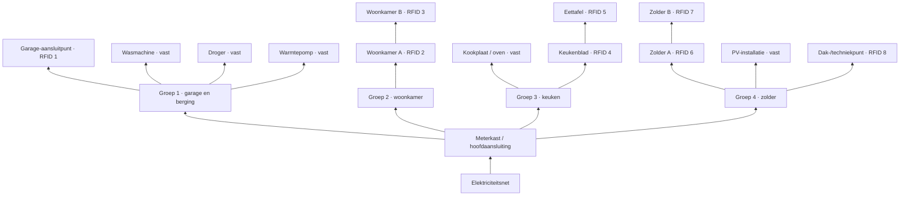

# Interactief demonstratiemodel elektrische huisinstallatie

## 1. Doel

Het model laat zien hoe verbruikers, zonnepanelen en stekker-thuisaccu's de stroom in afzonderlijke delen van een huisinstallatie beïnvloeden. Bezoekers plaatsen apparaten met RFID-tags bij verschillende aansluitpunten. De ESP32 herkent apparaat en locatie, rekent alle vermogensstromen opnieuw uit en toont richting en belasting met adresseerbare RGB-leds.

De kern van de demonstratie is dat een groepsautomaat alleen de **netto stroom op zijn eigen meetpunt** ziet. Een thuisaccu die verderop op dezelfde groep invoedt, kan die gemeten stroom verlagen, terwijl een kabeldeel, stekkerdoos of contactdoos tussen accu en verbruiker toch zwaar belast raakt.

Dit is een educatief laagspanningsmodel; de leds en RFID-modules worden niet rechtstreeks met 230 V verbonden.

## 2. Voorgestelde huisindeling



De precieze vertakking moet overeenkomen met de getekende kabelroute op het fysieke paneel. Elk zichtbaar kabelsegment krijgt een eigen reeks led-indexen en een eigen maximale stroom.

## 3. Apparatenmodel

Ieder apparaat krijgt een RFID-UID en een record in de firmware.

| Apparaat | Type | Voorlopig actief vermogen |
|---|---|---:|
| Wasmachine | vast verbruik | 2.000 W |
| Droger | vast verbruik | 2.500 W |
| Warmtepomp | vast verbruik | 1.500 W |
| Elektrisch koken/oven | vast verbruik | 3.500 W |
| PV-installatie | vaste leverancier | -3.000 W |
| Thuisaccu 1 | los, laden/ontladen | instelbaar, bijvoorbeeld ±800 W |
| Thuisaccu 2 | los, laden/ontladen | instelbaar, bijvoorbeeld ±800 W |
| Mobiele airco 1 en 2 | los verbruik | 1.200 W per stuk |
| Gourmetstel | los verbruik | 1.500 W |
| Föhn | los verbruik | 2.000 W |
| Bijzetkachel | los verbruik | 2.000 W |

Negatief vermogen betekent levering aan de installatie. De waarden zijn demonstratiewaarden en moeten later worden afgestemd op de werkelijk gebruikte apparaatkaartjes.

Aanbevolen recordstructuur:

```cpp
struct Device {
  uint8_t uid[10];
  uint8_t uidLength;
  const char* name;
  int32_t powerW;       // positief = verbruik, negatief = levering
  DeviceMode mode;      // LOAD, SOURCE of BIDIRECTIONAL
  int32_t maxChargeW;
  int32_t maxDischargeW;
};
```

## 4. Berekening van de energiestroom

Modelleer de huisinstallatie als een boom. Een aansluitpunt is een knoop; iedere getekende verbinding is een afzonderlijk segment.

Voor ieder segment geldt:

1. Tel alle vermogens stroomafwaarts van dat segment algebraïsch op.
2. Positief resultaat: vermogen loopt vanaf de meterkast naar de apparaten.
3. Negatief resultaat: vermogen loopt terug richting meterkast/net.
4. Bereken voor het enkelfasige demonstratiemodel `I = abs(P) / 230`.
5. Vergelijk deze stroom met de grenswaarde van dat specifieke segment.

Voorbeeld: een föhn van 2.000 W en een bijzetkachel van 2.000 W vragen samen circa 17,4 A. Een thuisaccu die op een verder stroomopwaarts gelegen contactdoos 800 W invoedt, kan de automaat slechts circa 13,9 A laten zien. Het kabeldeel tussen de accu-aftakking en de twee verbruikers voert echter nog steeds circa 17,4 A. Daardoor kan lokaal rood worden getoond terwijl het segment bij de automaat groen blijft.

Gebruik in de eerste versie een thermische grens van 16 A per standaard eindgroep en afzonderlijke, lagere grenzen voor demonstratieve stekkerdozen of dunne aftakkingen. Voeg eventueel een waarschuwing toe vanaf 80% van de grens.

## 5. Ledweergave

Een bruikbare visuele codering is:

- groen bewegend: veilige stroom naar een verbruiker;
- cyaan/blauw bewegend: veilige teruglevering naar de meterkast;
- geel/oranje: 80–100% van de segmentlimiet;
- rood bewegend of pulserend: limiet overschreden;
- gedimd wit: segment aanwezig maar vrijwel geen stroom;
- uit: segment niet actief of foutstatus.

De bewegingsrichting van de pixels geeft de vermogensrichting aan. De snelheid of pixeldichtheid kan evenredig zijn met `abs(P)`; de kleur blijft gereserveerd voor richting en veiligheid.

Leg de leds als segmenten vast, bijvoorbeeld:

```cpp
struct Segment {
  uint8_t fromNode;
  uint8_t toNode;
  uint16_t firstLed;
  uint16_t ledCount;
  bool reverseLedOrder;
  float maxCurrentA;
};
```

## 6. ESP32- en RC522-aansluitplan

Maximaal twaalf RC522-modules kunnen de SPI-bus delen. De aansluiting die op veel RC522-printjes `SDA` heet, is in SPI-modus feitelijk **SS/CS** en moet per lezer uniek zijn.

| Functie | ESP32 GPIO | Opmerking |
|---|---:|---|
| SPI SCK | 18 | gedeeld door alle RC522-modules |
| SPI MISO | 19 | gedeeld |
| SPI MOSI | 23 | gedeeld |
| RC522 CS 1 | 13 | uniek |
| RC522 CS 2 | 14 | uniek |
| RC522 CS 3 | 16 | uniek |
| RC522 CS 4 | 17 | uniek |
| RC522 CS 5 | 21 | uniek |
| RC522 CS 6 | 22 | uniek |
| RC522 CS 7 | 25 | uniek |
| RC522 CS 8 | 26 | uniek |
| RC522 CS 9 | 32 | uniek |
| RC522 CS 10 | 33 | uniek |
| RC522 CS 11 | 4 | uniek |
| RC522 CS 12 | 5 | uniek; boot-strapping-pin |
| RGB-ledstrip data | 27 | via 3,3→5 V levelshifter |

Dit gebruikt precies zestien GPIO's: twaalf CS/SDA-signalen, drie gedeelde SPI-signalen en één led-datasignaal. `IRQ` is niet nodig. RST krijgt geen GPIO maar wordt bij iedere RC522 hoog gehouden op 3,3 V; de gebruikte bibliotheek moet dan worden ingesteld op geen afzonderlijke resetpin.

GPIO 34–39 zijn alleen ingang en zijn daarom ongeschikt voor CS, reset of leddata. GPIO 1 en 3 blijven vrij voor USB-seriële diagnose. GPIO5 is een boot-strapping-pin. Hij is bruikbaar als CS zolang het aangesloten RC522-printje deze lijn tijdens reset niet naar een ongeldige toestand trekt. Gebruik op deze lijn geen extra sterke pull-up- of pull-downweerstand en controleer het opstarten met alle twaalf lezers aangesloten. GPIO12 wordt bewust niet gebruikt, omdat een verkeerd niveau tijdens reset de flashvoedingsinstelling kan veranderen en het opstarten kan verhinderen.

### Beoordeling aan de hand van de safe-pins-afbeelding

De afbeelding `naslag/ESP32-DevKitC-V4-safepins.png` gebruikt het profiel **ESP32 DevKitC V4 met 38 headerpinnen**. Het beschikbare bord op de projectfoto is een **30-pins DevKit V1 met ESP-WROOM-32-module**. De fysieke headerindeling is dus niet één-op-één gelijk; GPIO-nummers en de exacte modulemarkering zijn leidend.

De filter `Safe use` in ESP Pinout Explorer toont alleen pinnen zonder algemene waarschuwing. Een donkere pin is niet per definitie onbruikbaar:

- GPIO16 en GPIO17 zijn normale I/O op de afgebeelde ESP-WROOM-32-module en kunnen hier als CS worden gebruikt. Op ESP-WROVER-varianten kunnen deze pinnen door PSRAM bezet zijn; daarom geeft een generiek bordprofiel een waarschuwing.
- GPIO5 is bruikbaar, maar is een strapping-pin waarvan het niveau tijdens reset betekenis heeft. Deze blijft de enige voorwaardelijke pin in de voorgestelde indeling.
- GPIO12 wordt niet gebruikt vanwege het grotere opstartrisico rond `VDD_SDIO`/flashspanning.
- GPIO6–11 worden nooit gebruikt, omdat ze met het flashgeheugen zijn verbonden.
- GPIO34–39 zijn alleen geschikt als ingang.

Met de bevestigde ESP-WROOM-32-module zijn daarmee twaalf CS-uitgangen plus de drie SPI-signalen en leddata haalbaar. Controleer voor montage voor de zekerheid de tekst op de metalen modulekap; als een later bord een WROVER- of PSRAM-variant blijkt te zijn, moet de toewijzing van GPIO16/17 opnieuw worden beoordeeld.

## 7. Voeding en hardware-aandachtspunten

- Voed alle RC522-modules met **3,3 V**, nooit met 5 V op hun 3V3-aansluiting.
- Gebruik bij acht lezers bij voorkeur een aparte, stabiele 3,3 V-regelaar met voldoende marge en verbind alle massa's.
- Voed een 5 V adresseerbare ledstrip uit een aparte 5 V-voeding; niet uit de ESP32-print.
- Verbind de massa van ESP32, 3,3 V-voeding en ledvoeding.
- Plaats bij de ledstrip een serieweerstand van circa 330–470 ohm in de datalijn, een buffer zoals een 74AHCT125 voor het 5 V-dataniveau en een bufferelco bij de voedingsingang.
- Dimensioneer de 5 V-voeding op het werkelijke aantal pixels. Als conservatieve bovengrens geldt circa 60 mA per RGB-pixel bij vol wit; de animaties kunnen softwarematig in helderheid worden begrensd.
- Plaats de RC522-lezers minimaal 10 cm uit elkaar om onderlinge beïnvloeding van de antennes te beperken. De apparaatkaartjes worden opgenomen in 3D-mock-ups die met een magneet steeds op dezelfde plaats boven de lezer vastklikken. Houd de magneet bij voorkeur naast de antennespoel en verifieer per mock-up dat leesafstand en betrouwbaarheid niet afnemen.
- Poll de lezers één voor één. Als lezers ondanks de onderlinge afstand nog interfereren, kunnen niet-gebruikte antennes softwarematig worden uitgeschakeld of kan de voeding per lezer worden geschakeld.
- Voer de verbindingen uit met twisted-pair UTP-kabel en combineer iedere kritische datalijn met een eigen GND-ader in hetzelfde aderpaar. Dit verkleint de lusoppervlakte en verbetert de signaalintegriteit.
- Lange SPI-bedrading blijft storingsgevoelig. Plaats de ESP32 zo centraal mogelijk, gebruik geen onnodige aftakkingen of lange losse uiteinden en verlaag zo nodig de SPI-klok. Voor een groot huispaneel kan een lokale microcontroller of bufferoplossing per verdieping betrouwbaarder worden dan één lange SPI-ster.

### Gekozen UTP-topologie

De verwachte maximale kabellengte is circa 50–75 cm; de meeste verbindingen zijn korter. De bedrading bestaat uit één gemeenschappelijke UTP-ruggengraat en één CS/SDA-kabel per verdieping.

**Kabel 1 — gemeenschappelijke SPI-bus en voeding**

| Aderpaar | Signalen |
|---|---|
| paar 1 | SCK + GND |
| paar 2 | MOSI + GND |
| paar 3 | MISO + GND |
| paar 4 | 3,3 V + GND |

Deze kabel wordt langs de verdiepingen doorgekoppeld. Op iedere verdieping worden SCK, MOSI, MISO, 3,3 V en GND naar de aanwezige RC522-lezers afgetakt.

**Kabel 2, 3 en 4 — afzonderlijke CS/SDA-selectie per verdieping**

| Aderpaar | Signalen |
|---|---|
| paar 1 | CS/SDA lezer A + GND |
| paar 2 | CS/SDA lezer B + GND |
| paar 3 | CS/SDA lezer C + GND |
| paar 4 | CS/SDA lezer D + GND |

Iedere verdiepingskabel ondersteunt dus maximaal vier lezers. De drie kabels bieden samen twaalf CS/SDA-posities. Voor iedere werkelijk geplaatste lezer blijft een eigen ESP32-GPIO nodig; de herziene pinindeling ondersteunt alle twaalf rechtstreeks, zonder GPIO-expander.

Houd de aftakkingen van de gemeenschappelijke SPI-ruggengraat naar iedere lezer zo kort mogelijk. De totale lengte van 50–75 cm is goed bruikbaar, maar de stervormige zijtakken kunnen bij een hoge SPI-klok reflecties veroorzaken. Begin daarom met een lage SPI-klok, bijvoorbeeld 500 kHz of 1 MHz, en verhoog die alleen als alle lezers betrouwbaar blijven werken. Eventueel kunnen serieweerstanden van circa 33–100 ohm bij de ESP32-uitgangen SCK en MOSI de signaalflanken dempen.

Plaats per verdieping minimaal 100 nF en 47–100 µF tussen 3,3 V en GND en daarnaast bij iedere RC522 minimaal 100 nF zo dicht mogelijk bij de module. Meet bij volledige belasting ook de 3,3 V-spanning op het verste punt. Met deze korte lengtes zal de spanningsval doorgaans beperkt zijn, maar alle lezers samen belasten hetzelfde voedingspaar.

RST kan lokaal hoog worden gehouden of via een aanvullende verbinding gemeenschappelijk worden verdeeld. De GND-aders in de vier kabels worden elektrisch met elkaar verbonden, zodat alle signalen dezelfde referentie hebben. Niet-gebruikte CS/SDA-paren kunnen ongebruikt blijven; sluit ze niet aan op 3,3 V of GND tenzij daar bewust voor wordt gekozen.

## 8. Firmware-opbouw

1. Initialiseer SPI, de acht RC522-instanties en de ledstrip.
2. Poll iedere lezer cyclisch en filter kaartwisselingen tegen klapperen.
3. Vertaal UID naar apparaat; onbekende tags geven een herkenbare foutkleur.
4. Koppel ieder gedetecteerd apparaat aan het knooppunt van de betreffende lezer.
5. Voeg de ingeschakelde vaste apparaten en PV-opbrengst toe.
6. Bereken de vermogenssom vanaf de eindknopen terug naar de meterkast.
7. Bepaal per segment richting, stroom, belastingspercentage en status.
8. Werk alle ledsegmenten als één niet-blokkerende animatie bij.
9. Toon via USB-serieel een tabel met apparaat, locatie, segmentvermogen en overschrijdingen voor testen en uitleg.

De bediening van vaste apparaten kan later met drukknoppen, schakelaars of vaste RFID-posities worden uitgevoerd. Voor een eerste prototype zijn schakelaars eenvoudiger en laten zij de acht RFID-lezers vrij voor verplaatsbare apparatuur.

## 9. Aanbevolen bouwvolgorde

1. Maak eerst een klein proefmodel met twee RC522-lezers en één korte ledstrip.
2. Implementeer UID-herkenning en plaatsbepaling.
3. Test de netwerkberekening met één belasting en één thuisaccu op verschillende knopen.
4. Voeg per-segment animatie en grensbewaking toe.
5. Bouw daarna uit naar acht lezers en de volledige fysieke huisvorm.
6. Meet bij de volledige opstelling de 3,3 V-voeding en controleer RFID-betrouwbaarheid voordat het paneel definitief wordt gesloten.

## 10. Nog vast te leggen voor het definitieve schema

- het exacte aantal ledpixels en de pixelvolgorde per kabelsegment;
- de plaats van de acht RFID-lezers op de huistekening;
- welke vaste apparaten gelijktijdig schakelbaar zijn;
- het vermogen en laad-/ontlaadgedrag van beide thuisaccu's;
- de gekozen grenzen per kabel, contactdoos, stekkerdoos en groep;
- of de demonstratie één fase simuleert of ook faseverdeling/onbalans moet tonen.
